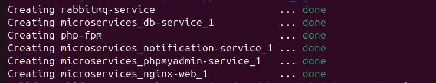

# Symfony Microservices Assignment

This project implements two microservices (`users` and `notifications`) that communicate via a message bus. The application is built using Symfony and Docker, with full test coverage including unit, integration, and functional tests.

## Table of Contents

- [Overview](#overview)
- [Technologies Used](#technologies-used)
- [Architecture](#architecture)
- [Requirements](#requirements)
- [Installation](#installation)
- [Running the Application](#running-the-application)
- [Running Tests](#running-tests)
- [Endpoints](#endpoints)
- [Docker Containers](#docker-containers)
- [Unit/Integration Testing](#unitintegration-testing)

## Overview

The application is designed as a microservices architecture, with the following components:

- **Users Service**: This microservice provides an endpoint to create users and stores the user data.
- **Notifications Service**: This microservice consumes events from the message bus and logs the user data.

The services are implemented using Symfony and are orchestrated within Docker containers. Symfony is used to build robust and scalable web applications and microservices. Docker containers are used to encapsulate each microservice and manage their deployment.

## Technologies Used

- **Symfony**: Symfony is a PHP web application framework known for its flexibility and scalability.
- **Docker**: Docker containers are used to deploy applications and services in a lightweight, portable environment.

## Architecture

1. **Users Service**:
   - Endpoint: `POST /users`
   - Request Body: `{"email": "zubidev@gmail.com", "firstName": "Muhammad", "lastName": "Khan"}`
   - Function: Stores the user data in a database or log file and sends an event to the message broker.

2. **Notifications Service**:
   - Consumes events from the message broker and logs the user data.

## Requirements

- Docker
- Docker Compose
- PHP 8.0 or later
- Composer
- Symfony CLI

## Installation

1. Clone the GitHub repository to your local machine:
    ```bash
    git clone https://github.com/zubidev/microservices.git
    ```

2. Navigate into the `microservices` directory:
    ```bash
    cd microservices
    ```

3. Build and start the Docker containers using Docker Compose:
    ```bash
    docker-compose up --build -d
    ```

   
   *Docker containers building using Docker Compose.*

4. Navigate to the `user` directory and update dependencies:
    ```bash
    cd user
    composer update
    composer dumpautoload -o
    ```

5. Navigate back to the root directory and then to the `notification` directory. Update dependencies for the Notifications Service:
    ```bash
    cd ..
    cd notification
    sudo composer update   # Use sudo if necessary depending on your system configuration
    composer dumpautoload -o
    ```

6. To ensure all Docker services are running, execute the following command:
    ```bash
    docker ps
    ```

   
   *Listing running Docker containers.*

## Running the Application

### Check Services

First, ensure that the installed services are functioning locally:

#### PhpMyAdmin (Database)

PhpMyAdmin Local URL: [http://localhost:8081/](http://localhost:8081/)
- Username: root
- Password: test
- Database: microservices_db


*PhpMyAdmin interface for managing databases.*

#### RabbitMQ

RabbitMQ Local URL: [http://0.0.0.0:15672/](http://0.0.0.0:15672/)
- Username: user
- Password: password


*RabbitMQ management interface.*

### Test API Endpoint

If the services are running correctly, you can call any API platform's URL:

#### API Endpoint

- URL: [http://localhost:8080/api/user](http://localhost:8080/api/user)
- Method: POST
- Body:
  ```json
  {
      "firstName": "Muhammad",
      "lastName": "Khan",
      "email": "zubidev@gmail.com"
  }

### Expected Response
If the API call is successful, the response should look like this:
response:

```json
   {
    "success": true,
    "message": "User created successfully",
    "data": {
        "firstName": "Muhammad",
        "lastName": "Khan",
        "email": "zubidev@gmail.com"
    }
}
```


### Execute Notification Service Command

To consume messages issued by the notification service, use the following command:

```bash
docker-compose run --rm notification-service php bin/console messenger:consume -vv external_messages

```


## Unit/Integration Testing

### Test for user-services

#### Unit Testing

To run unit tests for user-services, execute the following command:

```bash
docker-compose run --rm php-fpm php bin/phpunit tests/unit
```


To run integration tests for user-services, execute the following command:

```bash
docker-compose run --rm php-fpm php bin/phpunit tests/integration
```


### Test for notification-services
#### Unit Testing
To run unit tests for notification-services, execute the following command:
```bash
docker-compose run --rm notification-service php bin/phpunit tests/unit
```

